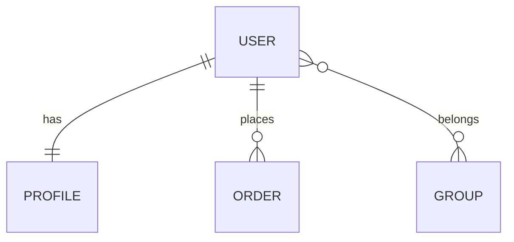
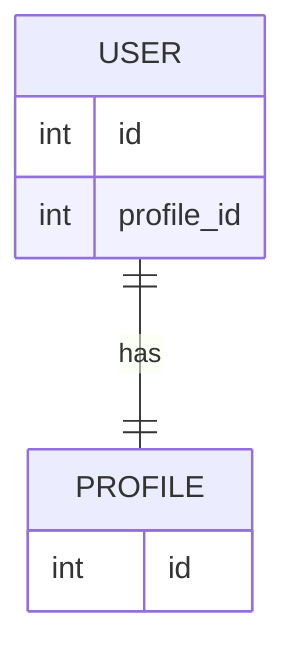
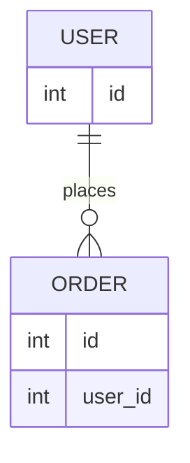
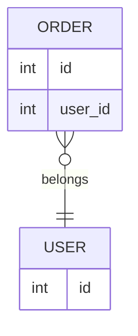
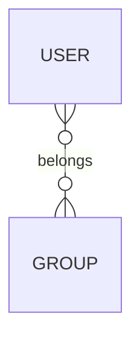
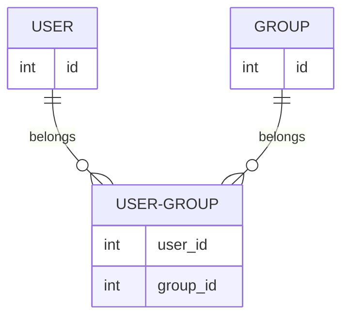
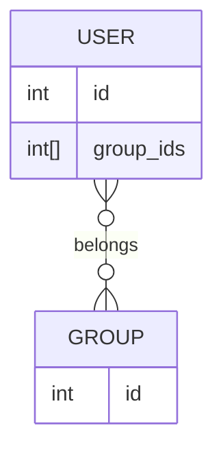
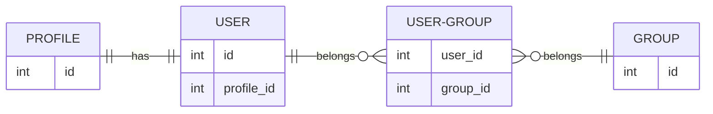

# Define Active Record Relations



## Define Relations

### Overriding `relationQuery()`

To define the relations in the Active Record model, you need to override `relationQuery()` method. This method should 
return an instance of `ActiveQueryInterface` interface for the relation name.

```php
use Yiisoft\ActiveRecord\ActiveRecord;
use Yiisoft\ActiveRecord\ActiveQueryInterface;

final class User extends ActiveRecord
{
    public function relationQuery(string $name): ActiveQueryInterface
    {
        return match ($name) {
            'profile' => $this->hasOne(Profile::class, ['id' => 'profile_id']),
            'orders' => $this->hasMany(Order::class, ['user_id' => 'id']),
            default => parent::relationQuery($name),
        };
    }
}
```

Also, you can use `relationQuery()` method to get a relation query by name.

```php
$user = new User();

$profileQuery = $user->relationQuery('profile');
$ordersQuery = $user->relationQuery('orders');
```

### Using `MagicRelationsTrait`

Alternatively, you can use [MagicRelationsTrait](traits/magic-relations.md) trait to define relations in the Active Record model.
This trait allows you to define relation methods directly in the model without overriding `relationQuery()` method.
The relation methods should have a specific naming convention to be recognized by the trait. The method names should 
have prefix `get` and suffix `Query` and returns an object implementing `ActiveQueryInterface` interface.

```php
use Yiisoft\ActiveRecord\ActiveQueryInterface;
use Yiisoft\ActiveRecord\ActiveRecord;
use Yiisoft\ActiveRecord\MagicRelationsTrait;

final class User extends ActiveRecord
{
    use MagicRelationsTrait;
    
    public function getProfileQuery(): ActiveQueryInterface
    {
        return $this->hasOne(Profile::class, ['id' => 'profile_id']);
    }
    
    public function getOrdersQuery(): ActiveQueryInterface
    {
        return $this->hasMany(Order::class, ['user_id' => 'id']);
    }
}
```

## Relation Methods

`ActiveRecord` class has two methods to define different relation types: `hasOne()` and `hasMany()`. Both methods have 
the same signature:

```php
public function hasOne(string|ActiveRecordInterface|Closure $class, array $link): ActiveQueryInterface;

public function hasMany(string|ActiveRecordInterface|Closure $class, array $link): ActiveQueryInterface;
```

- `$class` parameter is the class name of the related record, or an instance of the related record, or a Closure to
  create an `ActiveRecordInterface` object. For example: `Profile::class`, `new Profile()`, or `fn() => new Profile()`.
- `$link` parameter is an array that defines the foreign key constraint. The keys of the array refer to the attributes
  of the record associated with `$class` model, while the values of the array refer to the corresponding attributes 
  in the current Active Record class. For example: `['id' => 'profile_id']`, where `id` attribute of the related record 
  is linked to `profile_id` attribute of the current record.

## Relation Types

### One-to-one



To define a **one-to-one** relation, use `hasOne()` method.

```php
$this->hasOne(Profile::class, ['id' => 'profile_id']);
```

### One-to-many



To define a **one-to-many** relation, use `hasMany()` method.

```php
$this->hasMany(Order::class, ['user_id' => 'id']);
```

### Many-to-one



This type of relation is the same as the **one-to-one** relation, but the related record has many records associated 
with it. Use the `hasOne()` method to define this relation.

```php
$this->hasOne(User::class, ['id' => 'user_id']);
```

### Many-to-many

Use relationships when you need to link multiple records from one table to multiple records from another table.
This is common when entities have a bidirectional relationship, such as users belonging to multiple groups
and groups having multiple users.



This is a complex relation type that сan be implemented in several ways. To define this relation use `hasMany()` method.

#### Junction Table



This is the most common way to implement a **many-to-many** relation. You need to create a junction table that contains
foreign keys that reference the primary keys of the related tables.

```php
$this->hasMany(Group::class, ['id' => 'group_id'])->viaTable('user_group', ['user_id' => 'id']);
```

In the example, `user_group` table contains two foreign keys: 
- `user_id` attribute references the `id` attribute of the current record of `User` model;
- `group_id` attribute references the `id` attribute of the related record of `Group` model.

```php
use Yiisoft\ActiveRecord\ActiveRecord;
use Yiisoft\ActiveRecord\ActiveQueryInterface;

final class User extends ActiveRecord
{
    public int $id;

    public function relationQuery(string $name): ActiveQueryInterface
    {
        return match ($name) {
            'groups' => $this->hasMany(Group::class, ['id' => 'group_id'])->viaTable('user_group', ['user_id' => 'id']),
            default => parent::relationQuery($name),
        };
    }
}

final class Group extends ActiveRecord
{
    public int $id;

    public function relationQuery(string $name): ActiveQueryInterface
    {
        return match ($name) {
            'users' => $this->hasMany(User::class, ['id' => 'user_id'])->viaTable('user_group', ['group_id' => 'id']),
            default => parent::relationQuery($name),
        };
    }
}
```

Use this method when you don't need to store additional information in the junction table.

#### Junction Model

This is the most flexible way to implement a **many-to-many** relation. You need to create a junction model that
represents the junction table.

```php
$this->hasMany(Group::class, ['id' => 'group_id'])->via('userGroup');
```

In the example, `userGroup` is a relation name associated with the junction model. You need to define this relation
in the Active Record model.

```php
use Yiisoft\ActiveRecord\ActiveRecord;
use Yiisoft\ActiveRecord\ActiveQueryInterface;

final class User extends ActiveRecord
{
    public int $id;

    public function relationQuery(string $name): ActiveQueryInterface
    {
        return match ($name) {
            'groups' => $this->hasMany(Group::class, ['id' => 'group_id'])->via('userGroup'),
            'userGroup' => $this->hasMany(UserGroup::class, ['user_id' => 'id']),
            default => parent::relationQuery($name),
        };
    }
}

final class Group extends ActiveRecord
{
    public int $id;

    public function relationQuery(string $name): ActiveQueryInterface
    {
        return match ($name) {
            'users' => $this->hasMany(User::class, ['id' => 'user_id'])->via('userGroup'),
            'userGroup' => $this->hasMany(UserGroup::class, ['group_id' => 'id']),
            default => parent::relationQuery($name),
        };
    }
}

final class UserGroup extends ActiveRecord
{
    public int $user_id;
    public int $group_id;

    public function relationQuery(string $name): ActiveQueryInterface
    {
        return match ($name) {
            'user' => $this->hasOne(User::class, ['id' => 'user_id']),
            'group' => $this->hasOne(Group::class, ['id' => 'group_id']),
            default => parent::relationQuery($name),
        };
    }
}
```

Use this method when you need to store additional information in the junction table.

#### Array of Related Keys



This is the simplest way to implement a **many-to-many** relation. You don't need to create a junction table or a 
junction model to represent the junction table. Instead, you can use an array of related keys.

```php
$this->hasMany(Group::class, ['id' => 'group_ids']);
```

In the example, `group_ids` attribute of the current record is an array of related keys that reference `id` attribute 
of the related record. The array attribute can be represented in the database as an `array` type (currently supported 
by `PgSQL` driver only) or as a `JSON` type (currently supported by `MySQL`, `PgSql`, and `SQLite` drivers).

```php
use Yiisoft\ActiveRecord\ActiveRecord;
use Yiisoft\ActiveRecord\ActiveQueryInterface;

final class User extends ActiveRecord
{
    public int $id;
    public array $group_ids = [];

    public function relationQuery(string $name): ActiveQueryInterface
    {
        return match ($name) {
            'groups' => $this->hasMany(Group::class, ['id' => 'group_ids']),
            default => parent::relationQuery($name),
        };
    }
}

final class Group extends ActiveRecord
{
    public int $id;

    public function relationQuery(string $name): ActiveQueryInterface
    {
        return match ($name) {
            'users' => $this->hasMany(User::class, ['group_ids' => 'id']),
            default => parent::relationQuery($name),
        };
    }
}
```

Use this method when you don't need to store additional information in the junction table and the database supports
`array` or `JSON` types.

## Deep Linking

You can define relations that link through other relations using the `ActiveQueryInterface::via()` method.
This allows to access related records that are connected through intermediate relations.

For example, consider the following diagram:



To define a relation from `Profile` to `Group` through `User` and `UserGroup`, you can use the `via()` method as follows:

```php
use Yiisoft\ActiveRecord\ActiveQueryInterface;
use Yiisoft\ActiveRecord\ActiveRecord;

final class Profile extends ActiveRecord
{
    public function relationQuery(string $name): ActiveQueryInterface
    {
        return match ($name) {
            'user' => $this->hasOne(User::class, ['profile_id' => 'id']),
            'userGroups' => $this->hasMany(UserGroup::class, ['user_id' => 'id'])->via('user'),
            'groups' => $this->hasMany(Group::class, ['id' => 'group_id'])->via('userGroups'),
            default => parent::relationQuery($name),
        };
    }
}
```

Now you can access the `groups` relation from the `Profile` model as follows:

```php
$profile = Profile::query()->findByPk(1);
/** @var Group[] $groups */
$groups = $profile->relation('groups');
```

## Inverse Relations

An inverse relation is a relation defined in the related record to link back to the current record.
It associates the related record(s) with the current record in a more efficient way by avoiding additional queries.

To define an inverse relation, use the `ActiveQueryInterface::inverseOf()` method.

```php
$this->hasMany(Order::class, ['user_id' => 'id'])->inverseOf('user');
```

In the example, `user` is the inverse relation name associated with the `Order` model.

```php
use Yiisoft\ActiveRecord\ActiveRecord;
use Yiisoft\ActiveRecord\ActiveQueryInterface;

final class User extends ActiveRecord
{
    public int $id;

    public function relationQuery(string $name): ActiveQueryInterface
    {
        return match ($name) {
            'orders' => $this->hasMany(Order::class, ['user_id' => 'id'])->inverseOf('user'),
            default => parent::relationQuery($name),
        };
    }
}

final class Order extends ActiveRecord
{
    public int $id;
    public int $user_id;

    public function relationQuery(string $name): ActiveQueryInterface
    {
        return match ($name) {
            'user' => $this->hasMany(User::class, ['id' => 'user_id'])->inverseOf('orders'),
            default => parent::relationQuery($name),
        };
    }
}
```

## Eager Loading

**Relations are loaded lazily**, meaning that the related record(s) aren't loaded until you access them.
This allows you to load only the data you need and avoid unnecessary queries.

However, there are cases when you need to load the related record(s) in advance to avoid the **N+1 query problem**.
To do this, use the `ActiveQueryInterface::with()` method.

```php
use Yiisoft\ActiveRecord\ActiveQuery;

$users = User::query()->with('profile', 'orders')->all();
```

In the example, `profile` and `orders` are the relation names that you want to load in advance.

## Accessing Relations

To get the related record, use `ActiveRecordInterface::relation()` method. This method returns the related record(s)
or `null` (empty array for `AbstractActiveRecord::hasMany()` relation type) if the record(s) not found.

You can define getter methods to access the relations.

```php
use Yiisoft\ActiveRecord\ActiveRecord;
use Yiisoft\ActiveRecord\ActiveQueryInterface;

final class User extends ActiveRecord
{
    public function relationQuery(string $name): ActiveQueryInterface
    {
        return match ($name) {
            'profile' => $this->hasOne(Profile::class, ['id' => 'profile_id']),
            'orders' => $this->hasMany(Order::class, ['user_id' => 'id']),
            default => parent::relationQuery($name),
        };
    }
    
    public function getProfile(): Profile|null
    {
        return $this->relation('profile');
    }
    
    /** @return Order[] */
    public function getOrders(): array
    {
        return $this->relation('orders');
    }
}
```

## Usage

Now you can use `$user->getProfile()` and `$user->getOrders()` to access the relations.

```php
use Yiisoft\ActiveRecord\ActiveQuery;

$user = User::query()->where(['id' => 1])->one();

$profile = $user->getProfile();
$orders = $user->getOrders();
```

Back to

- [Create Active Record Model](create-model.md).
- [README](../README.md)
