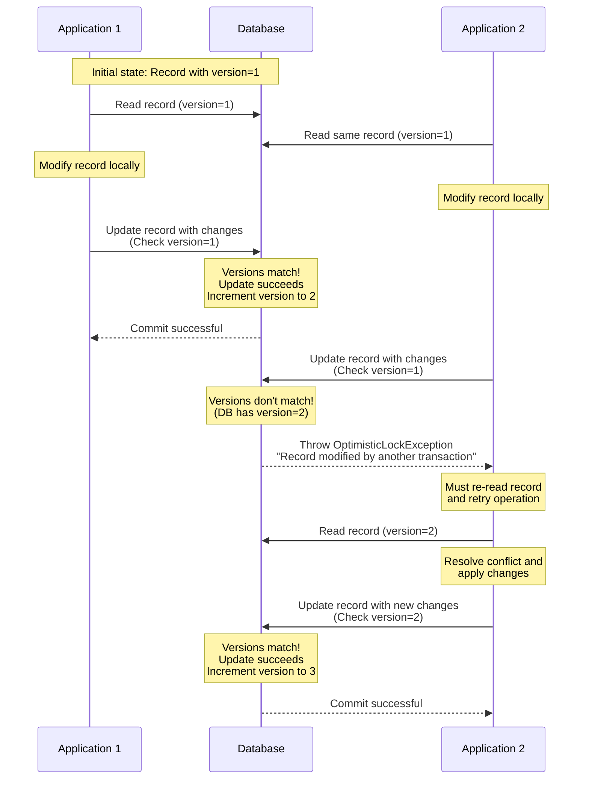

# Optimistic Locking

Optimistic locking is a concurrency control mechanism that allows multiple transactions to proceed without locking 
resources but checks for conflicts before committing changes. This approach is useful in scenarios where contention
for resources is low, and it helps to improve performance by reducing the overhead of locking.

## How It Works

In optimistic locking a version number is used to track changes to a record.

1. When a record is updated the version number is incremented;
2. Before committing the changes the application checks if the version number in the database matches the version number
   in the application;
3. If they match the changes are committed otherwise an exception is thrown indicating that the record has been modified
   by another transaction since it was read.



## Implementation

To implement optimistic locking in your Active Record model you need to follow these steps:

### 1. Add a version column

Add a version column to your database table. This column will be used to track changes to the record.
For example, you can add a `version` column of type `bigint`.

```sql
ALTER TABLE document ADD COLUMN version BIGINT DEFAULT 0;
```
### 2. Define the version property

In your Active Record model, define a property for the version column and implement the `OptimisticLockInterface`
interface.

```php
use Yiisoft\ActiveRecord\ActiveRecord;
use Yiisoft\ActiveRecord\OptimisticLockInterface;

final class Document extends ActiveRecord implements OptimisticLockInterface
{
   public int $id;
   public string $title;
   public string $content;
   public int $version;

   public function optimisticLockPropertyName(): string
   {
       return 'version';
   }
}
```

### 3. Handle optimistic locking exceptions
When saving, updating or deleting the record handle the `OptimisticLockException` exception that is thrown 
if the version number does not match.

```php
use Yiisoft\ActiveRecord\OptimisticLockException;

try {
    $document->save();
} catch (OptimisticLockException $e) {
    // Handle the exception, e.g. reload the record and retry logic or inform the user about the conflict

    $document->refresh();
    // Retry logic
}
```

## Usage with Web Application

In a web application, you can use optimistic locking in your controllers or services where you handle the business logic.

For example, when updating a document:

```php
use Psr\Http\Message\ResponseInterface;
use Psr\Http\Message\ServerRequestInterface;
use Yiisoft\ActiveRecord\ActiveQuery;

final class DocumentController
{
    public function edit(
        ServerRequestInterface $request,
    ): ResponseInterface {
        $id = (int) $request->getAttribute('id');

        $document = (new ActiveQuery(Document::class))->findOne($id);

        if ($document === null) {
            throw new NotFoundException('Document not found.');
        }

        // Render the document edit form with the current version
    }

    public function save(
        ServerRequestInterface $request,
    ): ResponseInterface {
        $data = $request->getParsedBody();
        
        $id = (int) $data['id'];
        $document = (new ActiveQuery(Document::class))->findOne($id);

        if ($document === null) {
            throw new NotFoundException('Document not found.');
        }
    
        $document->title = $data['title'] ?? '';
        $document->content = $data['content'] ?? '';
        $document->version = (int) ($data['version'] ?? 0);

        try {
            $document->save();
        } catch (OptimisticLockException $e) {
            // Handle the exception, e.g. reload the record and retry logic or inform the user about the conflict

            $document->refresh();
            // Retry logic
        }

        // Redirect or render success message
    }
}
```
