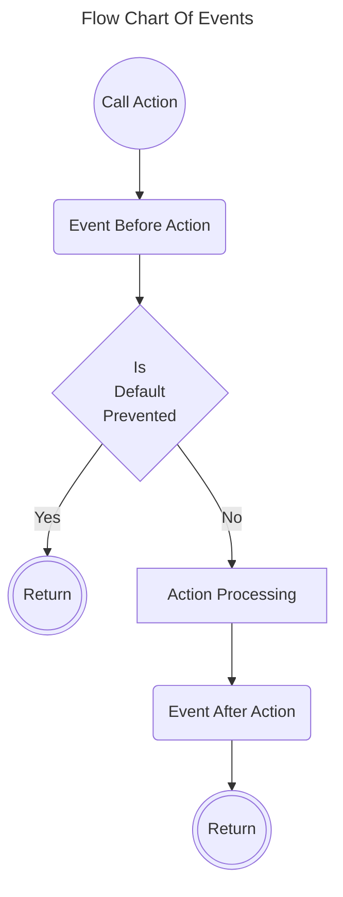

# EventsTrait

`EventsTrait` allows using events in Active Record classes.



## Events

Each event is represented as a class that extends [AbstractEvent](../../src/Event/AbstractEvent.php) class 
and has an `ActiveRecordInterface` instance as a target object.

The following events are supported:

Action       | Event Before Action                                        | Event After Action                                       
-------------|------------------------------------------------------------|----------------------------------------------------------
Create Query | [BeforeCreateQuery](../../src/Event/BeforeCreateQuery.php) | [AfterCreateQuery](../../src/Event/AfterCreateQuery.php) 
Populate     | [BeforePopulate](../../src/Event/BeforePopulate.php)       | [AfterPopulate](../../src/Event/AfterPopulate.php)       
Save         | [BeforeSave](../../src/Event/BeforeSave.php)               | [AfterSave](../../src/Event/AfterSave.php)               
Insert       | [BeforeInsert](../../src/Event/BeforeInsert.php)           | [AfterInsert](../../src/Event/AfterInsert.php)           
Update       | [BeforeUpdate](../../src/Event/BeforeUpdate.php)           | [AfterUpdate](../../src/Event/AfterUpdate.php)           
Upsert       | [BeforeUpsert](../../src/Event/BeforeUpsert.php)           | [AfterUpsert](../../src/Event/AfterUpsert.php)           
Delete       | [BeforeDelete](../../src/Event/BeforeDelete.php)           | [AfterDelete](../../src/Event/AfterDelete.php)           

Each action is called by the corresponding method in the Active Record class, e.g. `insert()`, `update()`, `delete()`.

> [!IMPORTANT]
> Action **Save** also calling **Insert** or **Update** action depending on the record state.

## Handling Events

To handle events you should specify the event handler using attributes in the Active Record model class.

The following event handlers are provided:

| Event Handlers                                                                 | Handled Events                 | Description                                                                                                  |
|--------------------------------------------------------------------------------|--------------------------------|--------------------------------------------------------------------------------------------------------------|
| [DefaultDateTimeOnInsert](../../src/Event/Handler/DefaultDateTimeOnInsert.php) | BeforeInsert, BeforeUpsert     | Sets default date and time for the properties before inserting (by default `created_at` and `updated_at`)    |
| [DefaultValue](../../src/Event/Handler/DefaultValue.php)                       | AfterPopulate                  | Sets default value for the properties after populating                                                       |
| [DefaultValueOnInsert](../../src/Event/Handler/DefaultValueOnInsert.php)       | BeforeInsert, BeforeUpsert     | Sets default value for the properties before inserting                                                       |
| [SetDateTimeOnUpdate](../../src/Event/Handler/SetDateTimeOnUpdate.php)         | BeforeUpdate, BeforeUpsert     | Sets date and time for the properties before updating (by default `updated_at`)                              |
| [SetValueOnUpdate](../../src/Event/Handler/SetValueOnUpdate.php)               | BeforeUpdate, BeforeUpsert     | Sets value for the properties before updating                                                                |
| [SoftDelete](../../src/Event/Handler/SoftDelete.php)                           | AfterCreateQuery, BeforeDelete | Implements soft deletion                                                                                     |

## Creating Event Handlers

To create your own event handler you should create a class which extends [AttributeHandlerProvider](../../src/Event/Handler/AttributeHandlerProvider.php) class
and implement `getEventHandlers()` method which should return an array of event handler definitions 
with the event class name as a key and the handler closure as a value.

The following example shows how to create a custom event handler which increments the value of the property by one 
on each update:

```php
use Yiisoft\ActiveRecord\Event\Handler\AttributeHandlerProvider;
use Yiisoft\ActiveRecord\Event\BeforeUpdate;

#[Attribute(Attribute::TARGET_CLASS | Attribute::TARGET_PROPERTY | Attribute::IS_REPEATABLE)]
final class UpdatedCount extends AttributeHandlerProvider
{
    public function getEventHandlers(): array
    {
        return [
            BeforeUpdate::class => $this->updatedCount(...),
        ];
    }
    
    private function updatedCount(BeforeUpdate $event): void
    {
        $model = $event->model;
        
        foreach ($this->getPropertyNames() as $propertyName) {
            if ($model->hasProperty($propertyName)) {
                $model->set($propertyName, $model->get($propertyName) + 1);
            }
        }
    }
}
```

## Usage

To use events in your Active Record class you should specify the event handlers using attributes.

```php
use Yiisoft\ActiveRecord\ActiveRecord;
use Yiisoft\ActiveRecord\Trait\EventsTrait;

#[DefaultDateTimeOnInsert]
#[SetDateTimeOnUpdate]
#[SoftDelete]
final class User extends ActiveRecord
{
    use EventsTrait;
    
    protected DateTimeImmutable|null $created_at = null;
    protected DateTimeImmutable|null $updated_at = null;
    protected DateTimeImmutable|null $deleted_at = null;
    #[UpdatedCount]
    protected int $updated_count = 0;
}

$user = new User();
$user->insert(); // `created_at` and `updated_at` will be set to the current date and time before inserting
$user->update(); // `updated_at` will be set to the current date and time before updating
$user->delete(); // `deleted_at` will be set to the current date and time and the record will not be deleted from the database
User::query()->all(); // Only records with `deleted_at` equals to NULL will be returned
```
